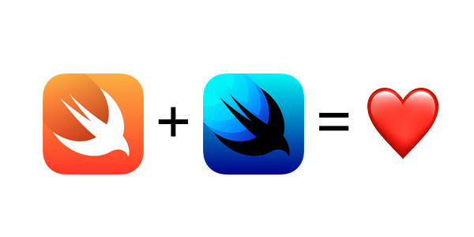

# SwiftUI Snippets

_"**Code Snippet**" is a term used to describe a small portion of re-usable source code, machine code, or text. They allow a programmer to avoid typing repetitive code during the course of routine programming._

