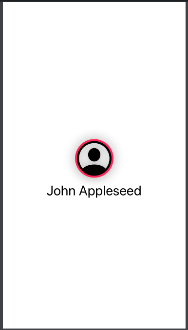

# Image



### Simple Image

```swift
Image(systemName: imageName)
```

### Image using UIImage

```swift
Image(uiImage: UIImage(data: contact.avatarData))
```

### Resize Image with fixed size

```swift
Image(uiImage: UIImage(data: contact.avatarData))
                    .resizable()
                    .frame(width: 40.0, height: 40.0)
                    .aspectRatio(contentMode: .fit)
```

### Image within a clip shape \(Avatar Image\)

```swift
Image(uiImage: UIImage(data: contact.avatarData))
                    .resizable()
                    .frame(width: 40.0, height: 40.0)
                    .aspectRatio(contentMode: .fit)
                    .clipShape(Circle())
```

### Image inside a Button

```swift
Image(uiImage: UIImage(data: contact.avatarData!)!)
                    .renderingMode(.original)
```

### Text below Image

```swift
VStack {
    Image(systemName: "person.crop.circle")
        .resizable()
        .frame(width: 75.0, height: 75.0)
        .clipShape(Circle())
        .overlay(
            Circle().stroke(Color.pink, lineWidth: 4)
    )
        .shadow(radius: 10)
        .padding(.top)
    
    Text("Arjun Komath")
        .font(.title)
}
```



