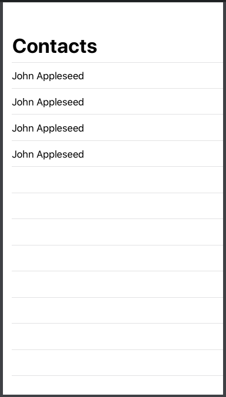

# List



### List of Text

```swift
List {
    Text("John Appleseed")
    Text("John Appleseed")
    Text("John Appleseed")
    Text("John Appleseed")
}
```

### List inside [NavigationView](../layout-and-views/navigationview.md)

```swift
NavigationView {
    List {
        Text("John Appleseed")
        Text("John Appleseed")
        Text("John Appleseed")
        Text("John Appleseed")
    }
    .navigationBarTitle("Contacts")
}
```



### List using ForEach

```swift
let names: [String] = [
    "Lorretta",
    "Tonie",
    "Leesa",
    "So",
    "Sammy"
]

struct ContentView: View {
    var body: some View {
        List {
            ForEach(names, id: \.self) { name in
                Text(name)
            }
        }
    }
}
```

