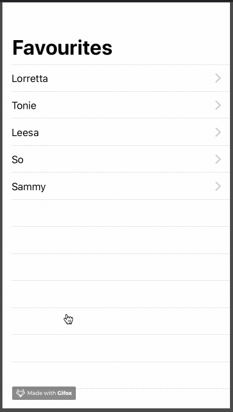

# NavigationView



### Simple NavigationView

```swift
struct ContentView: View {
    var body: some View {
        NavigationView {
            List {
                ForEach(names, id: \.self) { name in
                    Text(name)
                }
            }
            .navigationBarTitle("Favourites")
        }
    }
}
```

### NavigationView with style modifier

```swift
struct ContentView: View {
    var body: some View {
        NavigationView {
            List {
                ForEach(names, id: \.self) { name in
                    Text(name)
                }
            }
            .navigationBarTitle("Favourites", displayMode: .inline)
            // or .automatic or .large
        }
    }
}
```

### Navigate to another View

```swift
struct ContentView: View {
    var body: some View {
        NavigationView {
            List {
                ForEach(names, id: \.self) { name in
                    NavigationLink(destination: UserView(name: name)) {
                        Text(name)
                    }
                }
            }
            .navigationBarTitle("Favourites")
        }
    }
}

struct UserView: View {
    let name: String

    var body: some View {
        VStack {
            Text(name)
                .font(.largeTitle)
        }
    }
}
```

### Adding custom back button

```swift
struct ContentView: View {
    var body: some View {
        NavigationView {
            List {
                ForEach(names, id: \.self) { name in
                    NavigationLink(destination: UserView(name: name)) {
                        Text(name)
                    }
                }
            }
            .navigationBarTitle("Favourites")
        }
    }
}

struct UserView: View {
    @Environment(\.presentationMode) var presentation
    
    let name: String

    var body: some View {
        VStack {
            Text(name)
                .font(.largeTitle)
            Button("Go back") {
                self.presentation.wrappedValue.dismiss()
            }
        }
    }
}
```



