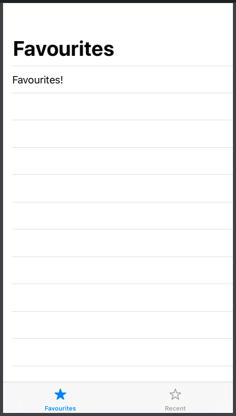

# TabView



### Simple TabView

```swift
struct ContentView: View {
    @State private var selection = 0
    
    var body: some View {
        TabView(selection: $selection) {
            Text("Favourites!")
                .tag(0)
                .tabItem {
                    VStack {
                        Image(systemName: selection == 0 ? "star.fill" : "star")
                        Text("Favourites")
                    }
            }
            
            Text("Recent!")
                .tag(1)
                .tabItem {
                    VStack {
                        Image(systemName: selection == 1 ? "star.fill" : "star")
                        Text("Recent")
                    }
            }
        }
    }
}
```

### TabView with [NavigationView](navigationview.md)

```swift
struct ContentView: View {
    @State private var selection = 0
    
    var body: some View {
        TabView(selection: $selection) {
            NavigationView {
                List {
                    Text("Favourites!")
                }
                .navigationBarTitle("Favourites")
            }
            .tag(0)
            .tabItem {
                VStack {
                    Image(systemName: selection == 0 ? "star.fill" : "star")
                    Text("Favourites")
                }
            }
            
            NavigationView {
                List {
                    Text("Recent!")
                }
                .navigationBarTitle("Recent")
            }
            .tag(1)
            .tabItem {
                VStack {
                    Image(systemName: selection == 1 ? "star.fill" : "star")
                    Text("Recent")
                }
            }
        }
    }
}
```



