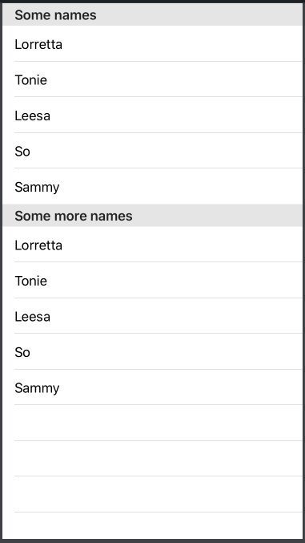
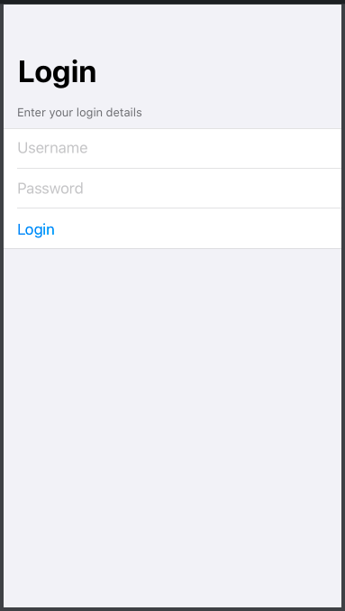

# Section



### Sections in a [List](list.md)

```swift
let names: [String] = [
    "Lorretta",
    "Tonie",
    "Leesa",
    "So",
    "Sammy"
]

struct ContentView: View {
    @State private var userName = ""
    @State private var password = ""
    
    var body: some View {
        List {
            Section(header: Text("Some names")) {
                ForEach(names, id: \.self) { name in
                    Text(name)
                }
            }
            
            Section(header: Text("Some more names")) {
                ForEach(names, id: \.self) { name in
                    Text(name)
                }
            }
        }
    }
}
```



### Section in a [Form](form.md)

```swift
struct ContentView: View {
    @State private var userName = ""
    @State private var password = ""
    
    var body: some View {
        NavigationView {
            Form {
                Section(header: Text("Enter your login details")) {
                    TextField("Username", text: $userName)
                    SecureField("Password", text: $password)
                    Button(action: {
                        print("do something")
                    }) {
                        Text("Login")
                    }
                }
            }.navigationBarTitle("Login")
        }
    }
}
```



